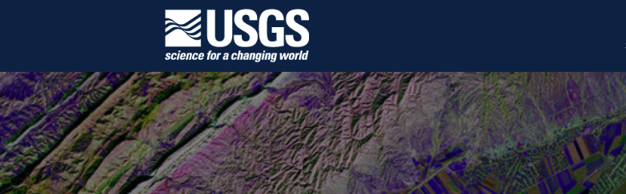
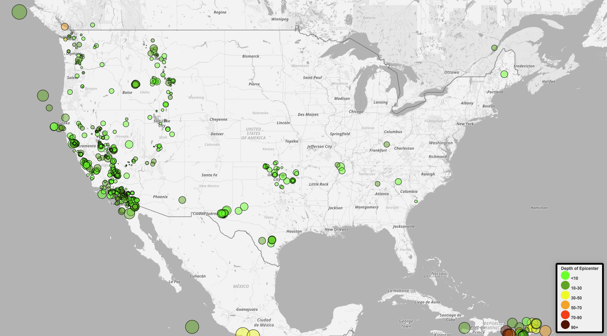
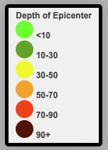

# Leaflet Homework: Visualizing Data with Leaflet

## Background

The United States Geological Survey (USGS) is responsible for providing scientific data about natural hazards, the health of our ecosystems and environment; and the impacts of climate and land-use change. Their scientists develop new methods and tools to supply timely, relevant, and useful information about the Earth and its processes. 
EarthQ
The USGS is interested in building a new set of tools that will allow them to visualize their earthquake data. They collect a massive amount of data from all over the world each day, but they lack a meaningful way of displaying it. Their hope is that being able to visualize their data will allow them to better educate the public and other government organizations (and hopefully secure more funding) on issues facing our planet.

### Before You Begin

In response to the USGS needs to have a visualization of thier dataset, I created a visualization that will help the United States Geological Survey team 
### Level 1: Basic Visualization

The data set was extracted from the USGS page taking into consideration "All Earthquakes" in the past 7 days. The data set was analyzed and plotted in the visualizationabove.

Below is the data set obtained from the USGS page

   

   The USGS provides earthquake data in a number of different formats, updated every 5 minutes. I visited the [USGS GeoJSON Feed](http://earthquake.usgs.gov/earthquakes/feed/v1.0/geojson.php) page and picked a data set to visualize. Below is the url of the JSON feed provided.
https://earthquake.usgs.gov/earthquakes/feed/v1.0/summary/all_week.geojson

   

The data was imported and I created a map using Leaflet that plots all of the earthquakes from the data set based on their longitude and latitude.

The data markers reflect the magnitude of the earthquake by their size and and depth of the earthquake by color. Earthquakes with higher magnitudes would appear larger and earthquakes with greater depth should appear darker in color. I include popups that provide additional information about the earthquake when a marker is clicked.

I then created a legend that will provide context for the map data.

 
- - -
